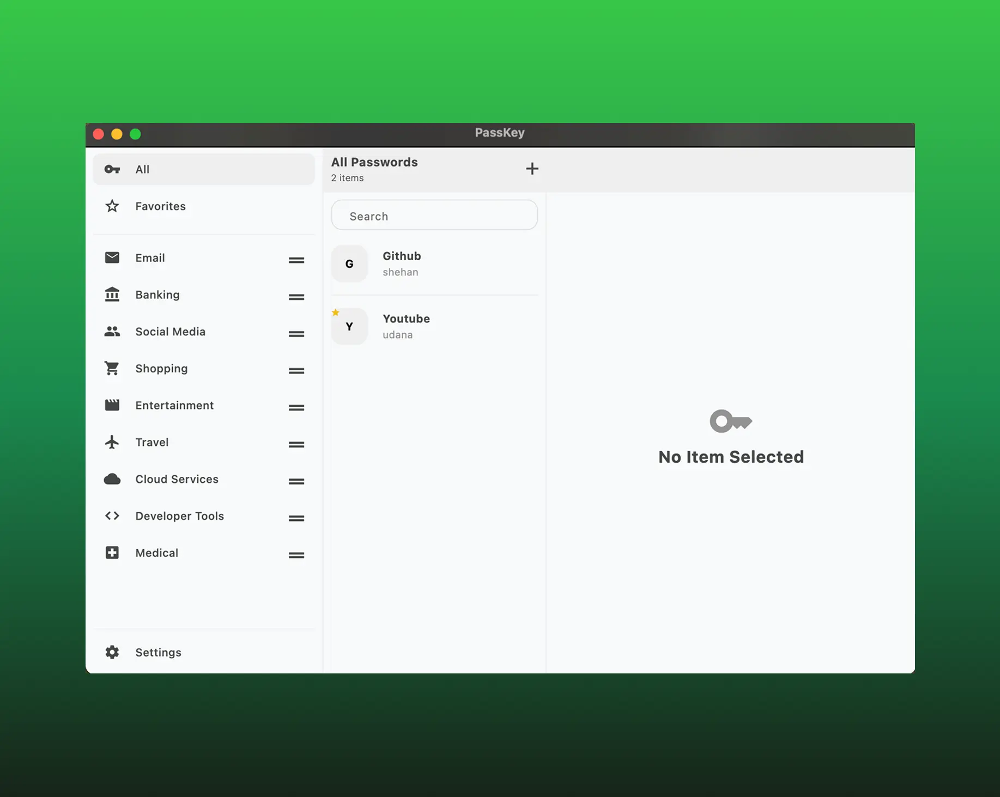

# Password Manager - PassKey

## Project Setup

Before you run the project, make sure to follow the steps below to properly set up the environment, generate necessary files.

### 1. Setup the `.env` file

You need to set up the `.env` file in the root directory of the project with your environment-specific variables.

#### Example:

Create a `.env` file in the root directory and include the following keys (replace with your values):

`PROJECT_URL=your_supabase_project_url`

 

`ANON_KEY=your_supabase_anon_key`

 

`ENCRYPTION_KEY=my32lengthsupersecretnooneknows1`

### 2. Generate Required Files

Run the following command to generate the necessary files (e.g: code related to the environment variables):

`dart run build_runner build`

 

